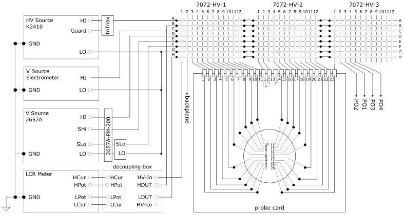

# PQC

Process Quality Control for CMS tracker

This is a modified version to test the PQC stuructes for HGCAL at Florida State University

## Overview

This application provides PQC sensor measurements.

### Required instruments

|Instrument                            |Role |
|:-------------------------------------|:----|
|Keithley 707B Switching Matrix        |Matrix |
|Keysight E4980A LCR Meter (E4980AL Single channel@FSU)            |LCR Meter |
|Keithley 6517B Electrometer           |ELM |
|Keithley 2410 Source Meter            |HV Source, V Source |
|Keithley 2470 Source Meter (optional) |HV Source, V Source |
|Keithley 2657A Source Meter (Not used at FSU)          |V Source, HV Source |
|Corvus TT positioning controller (Not used at FSU)     |Table |
|HEPHY Environment Box (Optional)                |Environment |

### Setup schematic



## Install

Install using pip in a virtual environment.

```bash
pip install git+https://github.com/Alam-Danish/comet-pqc.git@<version>
```

## Run

```bash
pqc
```

## Binaries

See for pre-built Windows binaries in the [releases](https://github.com/hephy-dd/comet-pqc/releases) section.

## License

comet-pqc is licensed under the [GNU General Public License Version 3](https://github.com/hephy-dd/comet-pqc/tree/main/LICENSE).
